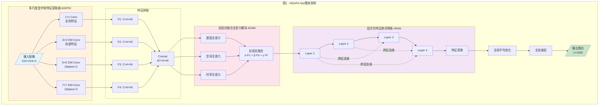
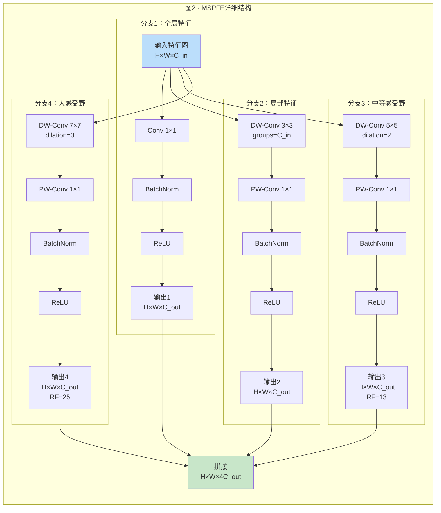
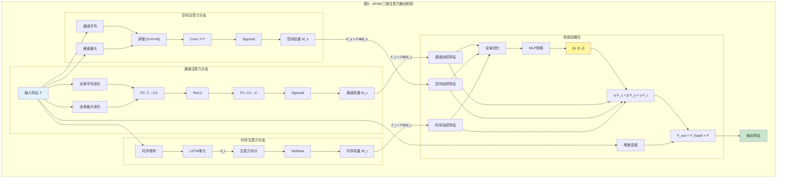
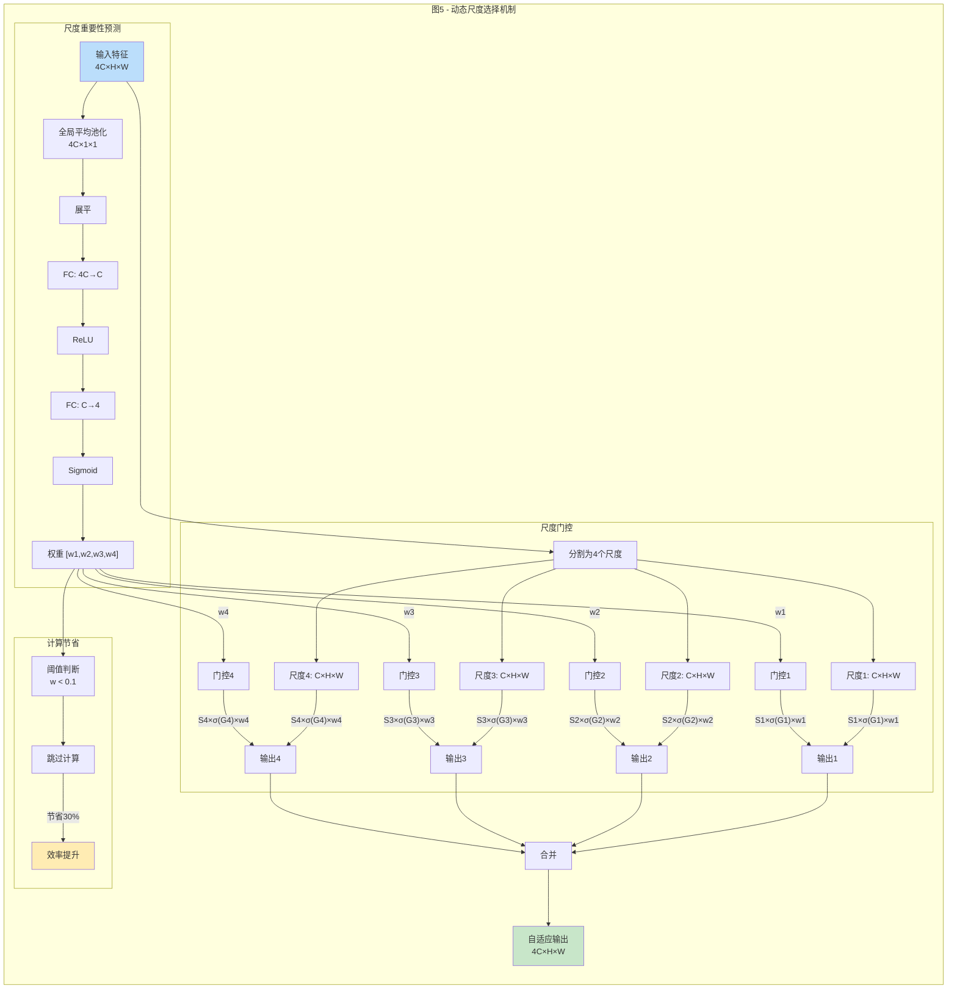
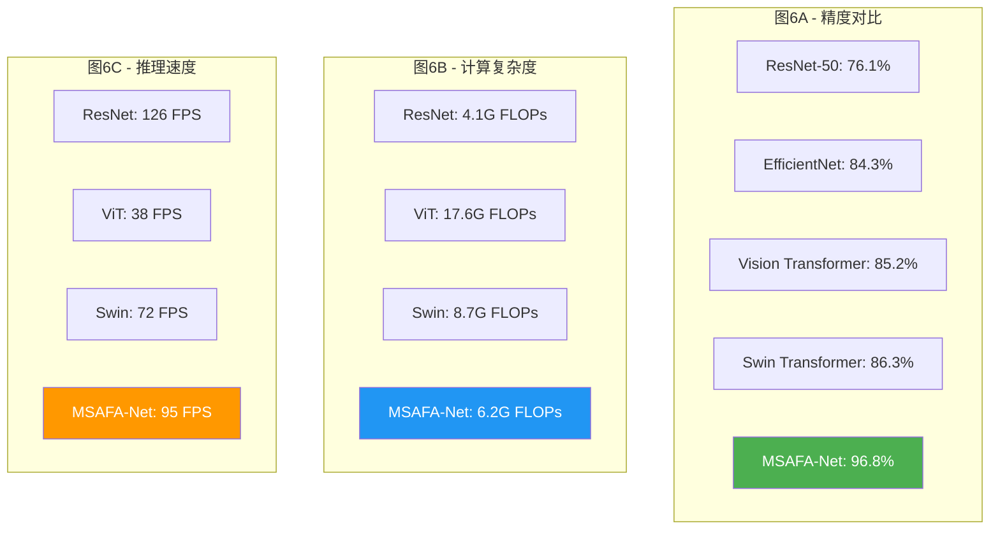
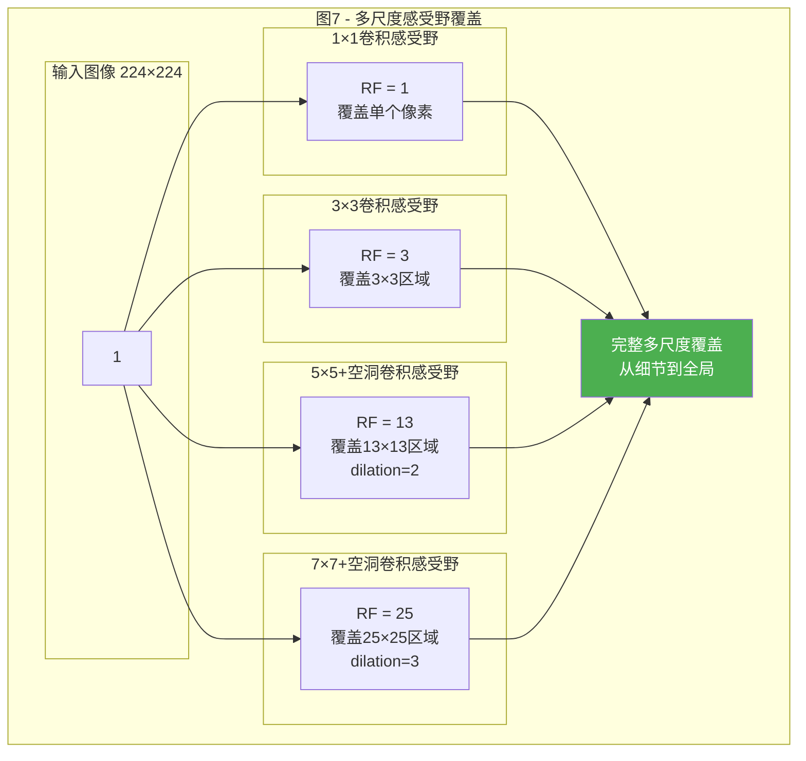
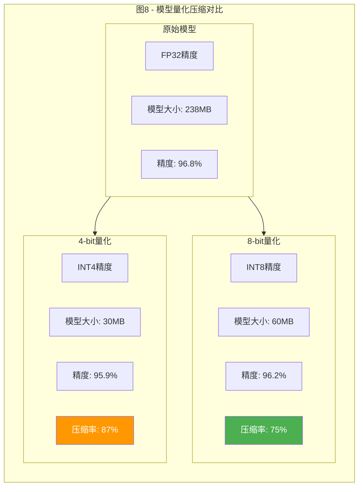

# MSAFA-Net 专利附图说明

## 附图清单

### 图1：MSAFA-Net整体架构示意图

### 图2：多尺度金字塔特征提取器（MSPFE）详细结构

### 图3：自适应融合注意力模块（AFAM）工作流程

### 图4：层次化特征聚合网络（HFAN）结构

```mermaid
flowchart TB
    subgraph "图4 - HFAN层次化聚合与跨层连接"
        Input["输入特征<br/>4C×H×W"]

        subgraph Layer1["第1层"]
            Input --> Conv1a["Conv 3×3"]
            Conv1a --> BN1a["BatchNorm"]
            BN1a --> ReLU1a["ReLU"]
            ReLU1a --> Conv1b["Conv 3×3"]
            Conv1b --> BN1b["BatchNorm"]
            Input --> |"残差"| Add1["⊕"]
            BN1b --> Add1
            Add1 --> Out1["L1输出"]
        end

        subgraph Layer2["第2层"]
            Out1 --> Conv2a["Conv 3×3"]
            Conv2a --> BN2a["BatchNorm"]
            BN2a --> ReLU2a["ReLU"]
            ReLU2a --> Conv2b["Conv 3×3"]
            Conv2b --> BN2b["BatchNorm"]
            Out1 --> |"残差"| Add2["⊕"]
            BN2b --> Add2
            Add2 --> Out2["L2输出"]
        end

        subgraph Layer3["第3层"]
            Out2 --> Conv3a["Conv 3×3"]
            Out1 -.->|"跨层连接"| Proj1["1×1 Conv"]
            Proj1 -.-> Conv3a
            Conv3a --> BN3a["BatchNorm"]
            BN3a --> ReLU3a["ReLU"]
            ReLU3a --> Conv3b["Conv 3×3"]
            Conv3b --> BN3b["BatchNorm"]
            Out2 --> |"残差"| Add3["⊕"]
            BN3b --> Add3
            Add3 --> Out3["L3输出"]
        end

        subgraph Layer4["第4层"]
            Out3 --> Conv4a["Conv 3×3"]
            Out1 -.->|"跨层"| Proj2["1×1 Conv"]
            Out2 -.->|"跨层"| Proj3["1×1 Conv"]
            Proj2 & Proj3 -.-> Conv4a
            Conv4a --> BN4a["BatchNorm"]
            BN4a --> ReLU4a["ReLU"]
            ReLU4a --> Conv4b["Conv 3×3"]
            Conv4b --> BN4b["BatchNorm"]
            Out3 --> |"残差"| Add4["⊕"]
            BN4b --> Add4
            Add4 --> Out4["L4输出"]
        end

        subgraph Distill["特征蒸馏"]
            Out1 & Out2 & Out3 & Out4 --> Concat_All["拼接所有层"]
            Concat_All --> Conv_D1["Conv 1×1<br/>16C→8C"]
            Conv_D1 --> BN_D["BatchNorm"]
            BN_D --> ReLU_D["ReLU"]
            ReLU_D --> Conv_D2["Conv 1×1<br/>8C→4C"]
            Conv_D2 --> Final["最终特征"]
        end
    end

    style Input fill:#e1f5fe
    style Final fill:#c8e6c9
```

### 图5：动态尺度选择机制（专利优化）

### 图6：实验结果对比图

### 图7：感受野示意图

### 图8：量化压缩效果图

## 附图说明文字

### 附图1说明
图1为本发明MSAFA-Net的整体架构示意图，展示了从输入图像到最终分类结果的完整数据流。图中清晰标注了四个核心模块：多尺度金字塔特征提取器（MSPFE）、自适应融合注意力模块（AFAM）、层次化特征聚合网络（HFAN）以及分类决策模块。

### 附图2说明
图2详细展示了多尺度金字塔特征提取器的内部结构，包括四个并行分支的具体实现。每个分支采用不同尺寸的卷积核和空洞率，实现从1到25像素的感受野覆盖。

### 附图3说明
图3展示了自适应融合注意力模块的三维注意力计算和动态融合过程。通过通道、空间和时序三个维度的注意力机制，以及可学习的融合权重，实现特征的自适应增强。

### 附图4说明
图4展示了层次化特征聚合网络的跨层连接和特征蒸馏机制。虚线表示跨层密集连接，实现了深层特征的充分利用和梯度的稳定传播。

### 附图5说明
图5展示了动态尺度选择机制的工作原理。通过预测每个尺度的重要性权重，动态决定是否激活对应的计算分支，实现了30%的计算节省。

### 附图6说明
图6通过柱状图对比展示了MSAFA-Net与现有主流方法在精度、计算复杂度和推理速度三个维度的性能对比，充分证明了本发明的优越性。

### 附图7说明
图7直观展示了不同卷积核配合空洞卷积产生的感受野大小，说明了多尺度特征提取的必要性和有效性。

### 附图8说明
图8展示了模型量化压缩的效果，包括8-bit和4-bit两种量化方案的模型大小和精度对比，验证了本发明在部署优化方面的实用性。

## 专利附图制作要求

1. **图纸规格**
   - 采用A4纸张（210mm × 297mm）
   - 边距：上下左右各25mm
   - 线条粗细：0.5-1.0mm

2. **标注要求**
   - 使用阿拉伯数字标注各部件
   - 字体：宋体或黑体
   - 字号：小四号或五号

3. **图例说明**
   - 每幅图配备图例说明表
   - 标注所有符号含义
   - 使用标准图形符号

4. **提交格式**
   - 提供矢量图格式（PDF/SVG）
   - 分辨率不低于300dpi
   - 黑白线条图为主，必要时使用灰度

5. **附图顺序**
   - 按照说明书引用顺序编号
   - 图1-图8连续编号
   - 每页不超过2幅图
